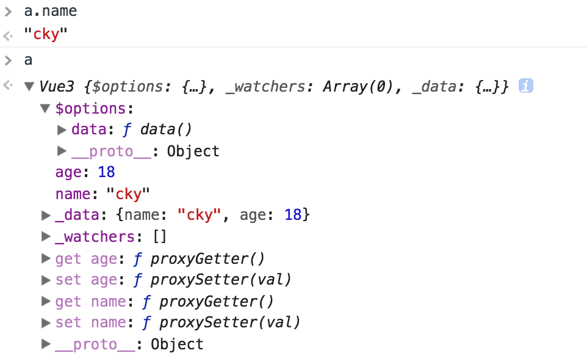

# Vue数据响应式原理

今天来看Vue的数据响应式原理，也就是watch一个值，改变了这个数据，能够得到通知并且在回调里获得新值和旧值从而进行操作，这一个功能的实现。本篇暂不包含与模板层的双向绑定。

## 数据初始化

```javascript
// demo/index.js
function Vue3(options) {
  this._init(options)
}
// 每次执行new Vue()操作都会执行的构造函数
Vue3.prototype._init = function(options) {
  const vm = this
  vm.$options = options || {}
  vm._watchers = []
  if (vm.$options.data) initData(vm)
}
function initData(vm) {
  let data = vm.$options.data
  // 将配置项data的值挂载在vm._data上，如果data是个函数，则调用`getData`方法获取返回值
  data = vm._data = typeof data === 'function' ? getData(data, vm) : data || {}

  // ...省略data的校验步骤
  const keys = Object.keys(data)
  let i = keys.length
  while (i--) {
    const key = keys[i]
    // ...省略data的key值校验步骤
    // 遍历 data 的 key，把 data 上的属性代理到 vm 实例上
    proxy(vm, '_data', key)
  }
  // observe(data, true /* asRootData */)
}

function getData(data, vm) {
  try {
    return data.call(vm, vm)
  } catch (e) {
    console.error(e)
    return {}
  }
}

function noop() {}

function proxy(target, sourceKey, key) {
  const sharedPropertyDefinition = {
    enumerable: true,
    configurable: true,
    get: noop,
    set: noop
  }
  // 获取 vm[key]值的时候，返回vm._data[key]
  sharedPropertyDefinition.get = function proxyGetter() {
    return this[sourceKey][key]
  }
  // 设置 vm[key]值的时候，vm._data[key] = val
  sharedPropertyDefinition.set = function proxySetter(val) {
    this[sourceKey][key] = val
  }
  // 将[key]挂载在vm上
  Object.defineProperty(target, key, sharedPropertyDefinition)
}

window.Vue3 = Vue3
```

通过以上的初始化，成功让配置项里`data`的每个值都挂到了`vm`实例上。并且`vm[key]`的操作会同步到`vm._data[key]`上

```javascript
var a = new Vue3({
  data(){
    return {
      name: 'cky',
      age: 18
    }
  }
})
```




## 观察者

上面在`initData()`函数中注释了一句

```javascript
observe(data, true /* asRootData */)
```

现在来看看这个函数是干什么的。

```javascript
// /demo/observer.js
import { isObject } from './util'

export function observe(value, asRootData) {
  // 如果不是对象，直接返回
  if (!isObject(value)) {
    return
  }
  let ob
  // 如果value对象上有__ob__属性，而且这个属性是Observer类的一个实例
  if (hasOwn(value, '__ob__') && value.__ob__ instanceof Observer) {
    ob = value.__ob__
  } else {
    // 否则ob为一个新的Oserver实例
    ob = new Observer(value)
  }
  // 如果是vm.$data, 那么 ob.vmCount++
  if (asRootData && ob) {
    ob.vmCount++
  }
  return ob
}

const hasOwnProperty = Object.prototype.hasOwnProperty
export function hasOwn(obj, key) {
  return hasOwnProperty.call(obj, key)
}

export function def(obj, key, val, enumerable) {
  Object.defineProperty(obj, key, {
    value: val,
    enumerable: !!enumerable,
    writable: true,
    configurable: true
  })
}
```

总结一下上面干了什么，`observe`函数返回的是一个`Observer`类的实例，如果传入的value有`__ob__`属性，直接返回，如果没有 则传入`value`值去构造一个`Observer`的实例并返回。

我们再来看看`Observer`类的定义

```javascript
export class Observer {
  // value
  // dep
  // vmCount // number of vms that has this object as root $data
  constructor(value) {
    this.value = value
    this.vmCount = 0
    // 给value添加'__ob__'属性，就是这个实例
    def(value, '__ob__', this)
    this.walk(value)
  }
  /**
   * 循环每个属性，并转换它们的getter/setters，这个方法只能用于Object类型的值
   */
  walk(obj) {
    const keys = Object.keys(obj)
    for (let i = 0; i < keys.length; i++) {
      // 第一次初始化时， obj: vm._data  keys[i]: key, obj[keys[i]]: value
      defineReactive(obj, keys[i], obj[keys[i]])
    }
  }
}
/**
 * 在一个对象上定义一个响应式的属性
 */
export function defineReactive(obj, key, val, customSetter, shallow) {
  const property = Object.getOwnPropertyDescriptor(obj, key)
  if (property && property.configurable === false) {
    return
  }

  const getter = property && property.get
  const setter = property && property.set

  Object.defineProperty(obj, key, {
    enumerable: true,
    configurable: true,
    get: function reactiveGetter() {
      // 如果之前这个字段已经定义过getter了就用之前的getter
      const value = getter ? getter.call(obj) : val
      return value
    },
    set: function reactiveSetter(newVal) {
      const value = getter ? getter.call(obj) : val
      if (newVal === value || (newVal !== newVal && value !== value)) {
        // 如果值没有改变 或者类似 NaN !== NaN这种情况
        return
      }
      if (process.env.NODE_ENV !== 'production' && customSetter) {
        customSetter()
      }
      if (setter) {
        setter.call(obj, newVal)
      } else {
        val = newVal
      }
      console.log(`我被改变了，新值:${newVal}, 旧值:${value}`)
    }
  })
}
```

总结一下上面的操作，`Observer`的构造函数给传入的`value`值增加`__ob__`属性，也就是这个构造出的实例，并且如果`value`是对象类型，会循环它的每个属性，调用`defineReactive`方法，而这个方法就是改写每个属性的`getter/setter`，从而可以在进行值获取和赋值的时候进行某些操作，也就能监听到值的改变。

看看执行上面代码的结果：

```javascript
var a = new Vue3({
  data(){
    return {
      name: 'cky',
      age: 18,
      mom: {
      name: 'zj',
        age: 28
      },
      friends: ['aa', 'bbb', 'ccc']
    }
  }
})
```


之前对于`vm.age`和`vm.name`也有`getter`和`setter`的重写，和这里的`vm._data.age`的`getter/setter`是不一样的，在`vm.age`的`getter`是去读`vm._data.age`，从而触发`vm._data.age`的`getter`，`setter`同理。其实真正对于数据改变的监听是在`_data`属性上的`getter`和`setter`上完成的。

## 数组更新检测

上面的操作在数组执行`push`这类的会改变数组的方法的时候，却没有任何作用，因为这个并不会触发`setter`。那对于数组`Vue`又是怎么处理的呢。

```javascript
// /demo/observer.js
import { arrayMethods } from './array'
export class Observer {
  constructor(value) {
    this.value = value
    this.dep = new Dep()
    this.vmCount = 0
    def(value, '__ob__', this)
    if (Array.isArray(value)) {
      value.__proto__ = arrayMethods
      this.observeArray(value)
    } else {
      this.walk(value)
    }
  }
  // walk()...
  observeArray (items) {
    for (let i = 0, l = items.length; i < l; i++) {
      observe(items[i])
    }
  }
}

// /demo/array.js
const arrayProto = Array.prototype
export const arrayMethods = Object.create(arrayProto)
const methodsToPatch = [
  'push',
  'pop',
  'shift',
  'unshift',
  'splice',
  'sort',
  'reverse'
]
/**
 * Intercept mutating methods and emit events
 */
methodsToPatch.forEach(function(method) {
  // cache original method
  const original = arrayProto[method]
  def(arrayMethods, method, function mutator(...args) {
    const result = original.apply(this, args)
    const ob = this.__ob__
    let inserted
    switch (method) {
      case 'push':
      case 'unshift':
        inserted = args
        break
      case 'splice':
        inserted = args.slice(2)
        break
    }
    if (inserted) ob.observeArray(inserted)
    // notify change
    console.log(`我是数组，被${method}方法改变了`)
    return result
  })
})
```

这个`array.js`文件`export`出了一个 `arrayMethods`，`arrayMethods` 继承了 `Array.prototype`，并在自身定义了那些变异方法来拦截原始数组的那些方法调用。
我们知道，当我们访问对象上的一个属性的时候，假如对象自身不存在这个属性，则会延续到它的 `__proto__` 上去找，找不到就继续。所以上面只需要把数组的 `__proto__` 指向 vue 自己的 `ArrayMethods` 就实现了拦截部分属性并继承原始 `Array` 的其他原型方法，十分巧妙。


官方文档说，不支持直接对数组`this.xx[n] = xyz`这样的赋值监听，提供了`Vue.set`和`this.$set` 方法，其实这个方法内部在前一篇也讲了，就是调用了`splice`这个变异方法从而实现监听。

## 依赖收集

上面的操作还是仅仅是观察者能够监听到了数组的变化，观察者看到发生变化后，就要去通知那些订阅者(`watcher`)。那这个订阅依赖是怎么统计起来的呢。首先，我们需要定义一个`Dep`类，这是观察者和订阅者的桥梁，它统计了所有的watcher，然后统一发出通知。

```JavaScript
// /demo/dep.js
export default class Dep {
  constructor () {
    this.id = uid++
    this.subs = []
  }
  addSub () {...}  // 添加订阅者(依赖)
  removeSub () {...}  // 删除订阅者(依赖)
  depend () {...}  // 检查当前Dep.target是否存在以及判断这个watcher已经被添加到了相应的依赖当中，如果没有则添加订阅者(依赖)，如果已经被添加了那么就不做处理
  notify () {...}  // 通知订阅者(依赖)更新
}
```

而什么时候该去添加依赖呢，其实就是你在获取这个值，而且说明自己是个订阅者的时候，就可以把你作为这个值的依赖了。
这一步就在`defineReactive`方法里实现，这一步重写了`getter`和`setter`，所以只需要在`getter`里记录依赖，在`setter`里通知改变就行了。

```javascript
// /demo/observer.js
export function defineReactive(obj, key, val, customSetter, shallow) {
  const dep = new Dep() // 该值的依赖收集器
  //...
  let childOb = !shallow && observe(val) // 返回的是一个Observer实例

  Object.defineProperty(obj, key, {
    enumerable: true,
    configurable: true,
    get: function reactiveGetter() {
      const value = getter ? getter.call(obj) : val
      if (Dep.target) { // 当订阅者存在的时候，才进行依赖收集
        dep.depend() // 依赖收集，
        if (childOb) {
          childOb.dep.depend()
          if (Array.isArray(value)) {
            dependArray(value)
          }
        }
      }
      return value
    },
    set: function reactiveSetter(newVal) {
      // ...
      dep.notify()
    }
  })
}
```

`Vue`的订阅者实现是一个`Watcher`类，在`Vue`的生命周期里，有四个地方会实例化这个类。

- `Vue`实例化的过程中有`watch`选项
- `Vue`实例化的过程中有`computed`计算属性选项
- `Vue`原型上有挂载`$watch`方法: `Vue.prototype.$watch`，可以直接通过实例调用`this.$watch`方法
- `Vue`生成了`render`函数，更新视图时

```javascript
// demo/watcher.js
export default class Watcher {
  constructor (vm, expOrFn, cb, options) {
    // 缓存这个实例vm
    this.vm = vm
    // vm实例中的_watchers中添加这个watcher
    vm._watchers.push(this)
    // options
    if (options) {
      this.deep = !!options.deep
      this.user = !!options.user
      this.lazy = !!options.lazy
      this.sync = !!options.sync
    } else {
      this.deep = this.user = this.lazy = this.sync = false
    }
    this.cb = cb
    this.id = ++uid // uid for batching
    this.active = true
    this.dirty = this.lazy // for lazy watchers
    ....
    // parse expression for getter
    if (typeof expOrFn === 'function') {
      this.getter = expOrFn
    } else {
      // eg: 'a.b.c'，parsePath方法返回了一个函数，接收obj参数，然后返回obj[a][b][c]的值
      this.getter = parsePath(expOrFn)
      if (!this.getter) {
        this.getter = function () {}
      }
    }
    // 通过get方法去获取最新的值
    // 如果lazy为true, 初始化的时候为undefined
    this.value = this.lazy
      ? undefined
      : this.get()
  }
  get () {...}
  addDep () {...}
  update () {...}
  run () {...}
  evaluate () {...}
  run () {...}
}
```

在除了`computed`选项外，其他几种实例化`watcher`的方式都是在实例化过程中完成求值及依赖的收集工作：`this.value = this.lazy ? undefined : this.get()`.在`Watcher`的`get`方法中:

```javascript
get () {
  // pushTarget即设置当前的需要被执行的watcher
  pushTarget(this)
  let value
  const vm = this.vm
  try {
    // $watch(function () {})
    // 调用this.getter的时候，触发了属性的getter函数
    // 在getter中进行了依赖的管理
    value = this.getter.call(vm, vm)
  } catch (e) {
    handleError(e, vm, `getter for watcher "${this.expression}"`)
  }
  // traverse方法其实就是遍历读取了value的值，从而遍历触发了下面的`getter`从而进行了依赖收集
  if (this.deep) {
    traverse(value)
  }
  // 完成了依赖收集
  popTarget()
  // 清理和删除老旧依赖
  this.cleanupDeps()
  return value
}
```

在`get()`方法中触发了`getter`，调用`dep.depend()`

```javascript
// demo/dep.js
  depend () {
    // 检查当前Dep.target是否存在以及判断这个watcher已经被添加到了相应的依赖当中，如果没有则添加订阅者(依赖)，如果已经被添加了那么就不做处理
    if (Dep.target) {
      // Dep.target为一个watcher
      Dep.target.addDep(this)
    }
  }
```

```javascript
// demo/watcher.js
  // 添加依赖
  addDep(dep) {
    // 某值的依赖收集器实例，如果这个依赖没有被收集过
    const id = dep.id
    if (!this.newDepIds.has(id)) {
      this.newDepIds.add(id)
      this.newDeps.push(dep)
      if (!this.depIds.has(id)) {
        dep.addSub(this)
      }
    }
  }
```

其他细节代码就不细说了，现在完善了代码，执行以下代码后：

```javascript
var a = new Vue3({
  data(){
    return {
       name: 'cky',
       age: 18,
       mom: {
	     name: 'zj',
         age: 28
       },
       friends: ['aa', 'bbb', 'ccc'],
       classmate: ['dd', 'ee', 'gg']
    }
  }
})
a.$watch('name', function(newValue, oldValue) {
  console.log(newValue, oldValue)
})
a.$watch('age', function(newValue, oldValue) {
  console.log(newValue, oldValue)
})
a.$watch('age', function(newValue, oldValue) {
  console.log(newValue, oldValue)
})
a.$watch('name', function(newValue, oldValue) {
  console.log(newValue, oldValue)
})
a.$watch('age', function(newValue, oldValue) {
  console.log(newValue, oldValue)
})
a.$watch(function(){
  return this.name + this.age
}, function(newValue, oldValue) {
  console.log(newValue, oldValue)
})
a.$watch('age', function(newValue, oldValue) {
  console.log(newValue, oldValue)
})
```


## 参考

[Vue的数据依赖实现原理简析](https://segmentfault.com/a/1190000010014281)