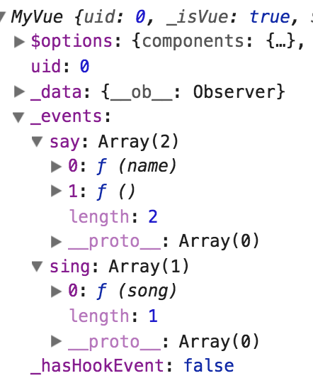

# Vue 事件机制

今天来看看vue的事件相关方法，本来想先看模板渲染和虚拟dom相关的内容，但是看了2天之后，感觉那一块内容很多而且难- -，所以先啃这块比较简单一点的骨头好了。

在实例化`Vue`的时候，初始化过程会调用一个`initEvent`函数，[initEvent](https://github.com/vuejs/vue/blob/dev/src/core/instance/events.js)

```javascript
export function initEvents (vm: Component) {
  // _events对象来缓存事件
  vm._events = Object.create(null)
  vm._hasHookEvent = false
  // init parent attached events
  // 模板事件相关，先不说
  // const listeners = vm.$options._parentListeners
  // if (listeners) {
  //   updateComponentListeners(vm, listeners)
  // }
}
```

在初始化事件的方法里，主要是生成了一个`vm._events`对象来缓存事件，`vm._hasHookEvent`来标识是否有钩子事件

`Vue`提供了4个实例方法供我们注册和触发事件。[vm.$on](https://cn.vuejs.org/v2/api/#vm-on)、[vm.$once](https://cn.vuejs.org/v2/api/#vm-once)、[vm.$off](https://cn.vuejs.org/v2/api/#vm-off)、[vm.$emit](https://cn.vuejs.org/v2/api/#vm-emit)

下面来分别看看它们的实现

## vm.$on

```javascript
const hookRE = /^hook:/
Vue.prototype.$on = function (event: string | Array<string>, fn: Function): Component {
  const vm: Component = this
  // 如果传入的event是数组，则循环每个event，递归调用$on绑定
  if (Array.isArray(event)) {
    for (let i = 0, l = event.length; i < l; i++) {
      this.$on(event[i], fn)
    }
  } else {
    // 如果vm._events[event]是一个数组，里面储存了触发这个事件时的回调方法定义
    // 如果存在就直接push，否则初始化[]
    (vm._events[event] || (vm._events[event] = [])).push(fn)
    // optimize hook:event cost by using a boolean flag marked at registration
    // instead of a hash lookup
    // 如果event包含 hook:xx 则标记_hasHookEvent为true
    if (hookRE.test(event)) {
      vm._hasHookEvent = true
    }
  }
  return vm
}
```

## vm.$emit

```javascript
Vue.prototype.$emit = function (event: string): Component {
  const vm: Component = this
  if (process.env.NODE_ENV !== 'production') {
    const lowerCaseEvent = event.toLowerCase()
    if (lowerCaseEvent !== event && vm._events[lowerCaseEvent]) {
      // 如果小写形式的event被注册了，但是本身传入的不是小写形式，则友情提示
      // tip(
      //   `Event "${lowerCaseEvent}" is emitted in component ` +
      //   `${formatComponentName(vm)} but the handler is registered for "${event}". ` +
      //   `Note that HTML attributes are case-insensitive and you cannot use ` +
      //   `v-on to listen to camelCase events when using in-DOM templates. ` +
      //   `You should probably use "${hyphenate(event)}" instead of "${event}".`
      // )
    }
  }
  // 该event的回调函数列表
  let cbs = vm._events[event]
  if (cbs) {
    cbs = cbs.length > 1 ? toArray(cbs) : cbs
    // 将剩余的参数转为数组
    const args = toArray(arguments, 1)
    for (let i = 0, l = cbs.length; i < l; i++) {
      // 依次调用回调函数
      try {
        cbs[i].apply(vm, args)
      } catch (e) {
        handleError(e, vm, `event handler for "${event}"`)
      }
    }
  }
  return vm
}
```

执行以下代码试试

```javascript
a.$on('say', function(name){
  console.log('say' + name)
})
a.$on('say', function(){
  console.log('say2')
})
a.$on('sing', function(song){
  console.log('sing a song: ' + song)
})
```



可以看到事件注册到了`_events`里，然后`$emit`触发。而且方法返回的是`vm`实例，所以我们还可以进行链式调用


## vm.$off

> 参数：
`{string | Array<string>} event` (只在 2.2.2+ 支持数组)
`{Function} [callback]`

> 用法：
- 移除自定义事件监听器。
- 如果没有提供参数，则移除所有的事件监听器；
- 如果只提供了事件，则移除该事件所有的监听器；
- 如果同时提供了事件与回调，则只移除这个回调的监听器。

```javascript
Vue.prototype.$off = function (event?: string | Array<string>, fn?: Function): Component {
  const vm: Component = this
  // all
  // 如果没有提供参数，则移除所有事件监听，_events设为空对象
  if (!arguments.length) {
    vm._events = Object.create(null)
    return vm
  }
  // array of events
  // 如果传了数组event，则循环递归调用$off移除每个event
  if (Array.isArray(event)) {
    for (let i = 0, l = event.length; i < l; i++) {
      this.$off(event[i], fn)
    }
    return vm
  }
  // specific event
  // 单个event，如果没被注册，则返回
  const cbs = vm._events[event]
  if (!cbs) {
    return vm
  }
  // 如果没有传入fn，则这个event的回调全部清空
  if (!fn) {
    vm._events[event] = null
    return vm
  }
  // 如果传了fn, 则循环回调列表删除该fn
  if (fn) {
    // specific handler
    let cb
    let i = cbs.length
    while (i--) {
      cb = cbs[i]
      // cb.fn见$once
      if (cb === fn || cb.fn === fn) {
        cbs.splice(i, 1)
        break
      }
    }
  }
  return vm
}
```

## vm.$once

```javascript
Vue.prototype.$once = function (event: string, fn: Function): Component {
  const vm: Component = this
  function on () {
    vm.$off(event, on)
    fn.apply(vm, arguments)
  }
  // 在$on方法注册event，且重新定义一个回调，在回调里调$off方法移除事件绑定，把原来的fn赋值给on.fn
  on.fn = fn
  vm.$on(event, on)
  return vm
}
```

